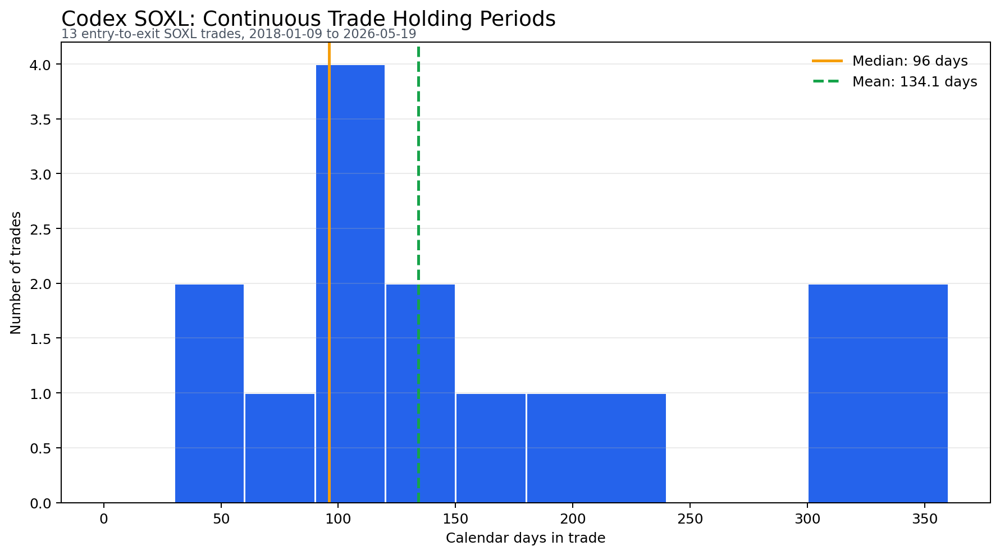
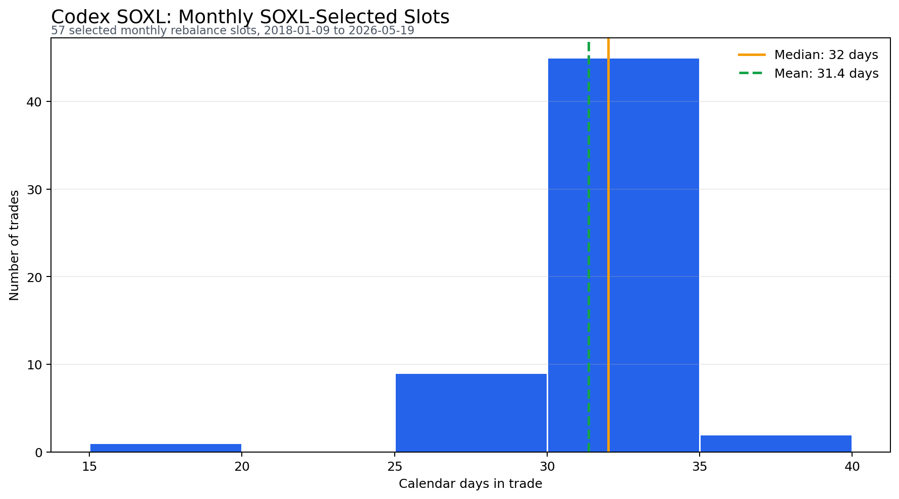

# Codex SOXL Holding Period Histogram

Source-aligned reconstruction of the saved TrendSpider strategy `Codex SOXL`.

- Symbol: SOXL
- Comparator: SMH
- Signal: 63-trading-day relative strength, evaluated on the first trading day of each month using the prior daily close
- Test window: 2018-01-09 to 2026-05-19
- Continuous entry-to-exit trades: 13
- Monthly SOXL-selected rebalance slots: 57

## Continuous Trade Buckets

| Calendar days in trade | Trades |
| --- | ---: |
| 0-30 | 0 |
| 31-60 | 2 |
| 61-90 | 2 |
| 91-120 | 3 |
| 121-150 | 2 |
| 151-180 | 1 |
| 181-240 | 1 |
| 241-300 | 0 |
| 301-360 | 2 |

## Continuous Trade Summary

| Metric | Value |
| --- | ---: |
| Trades | 13 |
| Min calendar days | 32 |
| Median calendar days | 96 |
| Mean calendar days | 134.1 |
| Max calendar days | 336 |
| Median trading days | 66 |

## Monthly Rebalance-Slot Check

This secondary view counts each SOXL-selected monthly rebalance slot separately. It is useful because TrendSpider's visible tester count appears closer to per-signal/monthly accounting than to continuous entry-to-exit rotations.

