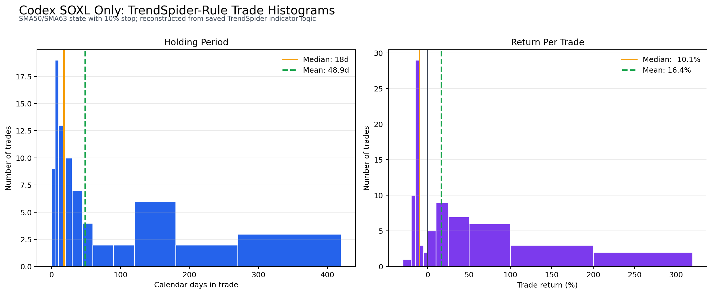

# Codex SOXL Only: TrendSpider-Rule Trade Histograms

This is a reconstruction from the saved TrendSpider indicator logic for `Codex SOXL Only Signals (50, 63, 10)`: SMA50/SMA63 state entry, exit on SMA state off or a 10% close-based stop. TrendSpider's visible Strategy Tester panel reported 78 positions; this reconstruction finds 77 trades from yfinance-adjusted SOXL data over the same displayed period, so treat the histograms as TrendSpider-rule-aligned rather than a raw TrendSpider trade export.

## Summary

| Metric | Reconstructed trades | TrendSpider visible aggregate |
| --- | ---: | ---: |
| Positions | 77 | 78 |
| Winners | 32 | not individually exported |
| Losses | 45 | not individually exported |
| Win rate | 41.56% | 45.00% |
| Mean return/trade | 16.41% | 16.37% |
| Median return/trade | -10.07% | not visible |
| Median holding period | 18 calendar days | not visible |
| Mean holding period | 48.9 calendar days | not visible |
| Max holding period | 412 calendar days | not visible |

## Holding Period Buckets

| Calendar days | Trades |
| --- | ---: |
| 0-5 | 12 |
| 6-10 | 16 |
| 11-20 | 14 |
| 21-30 | 11 |
| 31-45 | 6 |
| 46-60 | 4 |
| 61-90 | 1 |
| 91-120 | 2 |
| 121-180 | 6 |
| 181-270 | 2 |
| 271-420 | 3 |

## Return Buckets

| Return % | Trades |
| --- | ---: |
| -30 to -20 | 1 |
| -20 to -15 | 10 |
| -15 to -10 | 29 |
| -10 to -5 | 3 |
| -5 to 0 | 2 |
| 0 to 10 | 5 |
| 10 to 25 | 9 |
| 25 to 50 | 7 |
| 50 to 100 | 6 |
| 100 to 200 | 3 |
| 200 to 320 | 2 |
